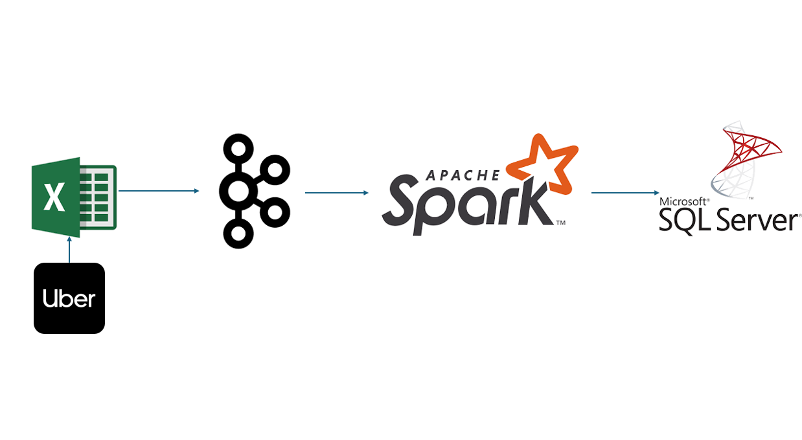

# 👋 Hello, I'm Naveen Reddy Tumu

---

## 🌟 About Me

I’m a **Data Engineer** with over 6 years of experience in designing, optimizing, and implementing scalable data pipelines. I have worked with industry leaders like **Verizon**, **Anthem Inc**, and **American Express**, contributing to critical data engineering initiatives that improved performance and reduced processing times. My expertise spans a wide range of technologies, including **Python**, **SQL**, **PySpark**, **Snowflake**, and **AWS**, along with a deep understanding of ETL workflows, big data processing, and cloud platforms.  

I hold a **Master of Science in Computer Science** from Wright State University, Ohio, and a **Bachelor of Technology in Computer Science** from Malla Reddy College of Engineering, Hyderabad. My educational background and professional experience make me a well-rounded data engineer passionate about building innovative, data-driven solutions.

---

## 🛠️ Technical Skills

- **Tech Stack:** Informatica, Kafka, Docker, Unix, Tableau, Power BI, Amazon Web Services (EC2, S3, Glue, RDS, Athena), Azure, Hadoop, Hive, Databricks, Snowflake.
- **Programming Languages:** Python, SQL, R, Scala, MySQL, PostgreSQL, MongoDB, BTEQ scripting.
- **Tools and Frameworks:** Apache Airflow, Control-M, JIRA, Machine Learning (Scikit-learn, Pandas, NumPy).

---

## 🔬 Technical Projects

### [Stock Market Data Pipeline](https://github.com/your-github/stock-market-data-pipeline)

The stock market generates **massive volumes of data every second**, making it critical to extract, transform, and load (ETL) this data in real time for analysis and decision-making. This project automates data ingestion from front-end APIs, applies transformations, and stores the processed data in AWS S3. By optimizing data workflows, the system reduces processing time by **60%**, ensuring end-users have access to actionable insights in real time.

---

### [Uber Data Pipeline](https://github.com/your-github/uber-data-pipeline)

Ride-sharing platforms like Uber rely heavily on **real-time data processing** to ensure seamless user experiences and operational efficiency. This project involves a scalable ETL pipeline designed to ingest, transform, and load data from Uber's front-end systems into SQL Server. The pipeline enables **real-time reporting** and supports data-driven decisions, ensuring system reliability and operational effectiveness.

---

### [Information Retrieval System](https://github.com/your-github/info-retrieval-system)

In the age of information overload, finding relevant data quickly is paramount. This project implements an **information retrieval system** using machine learning models for classification and clustering. By leveraging advanced algorithms, the system retrieves relevant documents with high precision and recall, optimizing the search experience and significantly reducing the time to find critical information.

---

## 📜 Certifications

- **Power BI Virtual Experience** - PwC  
- **Python Programming** - Kaggle & HackerRank  
- **SQL Certification** - HackerRank  

---

## 📂 Download My Resume

📄 [Download Resume](images/Naveen_Reddy.docx)

---

## 🔗 Let's Connect

- **GitHub:** [naveenreddy12](https://github.com/Naveen1203)  
- **LinkedIn:** [Naveen Reddy Tumu](https://www.linkedin.com/in/naveen-tumu-a4327b1b2/)  
- **Email:** [naveenreddy121510@gmail.com](mailto:naveenreddy121510@gmail.com)  
- **Phone:** +1 (513)-318-8968 

---

Thank you for visiting my portfolio! Let’s collaborate and build amazing projects together! 🚀
